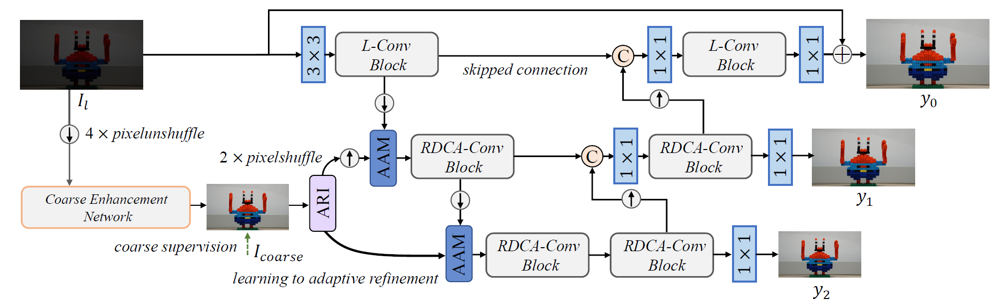

# [IEEE/CAA JAS 2026] LL-Refiner: Learning Adaptive Refinement for Ultra-High-Definition Low-Light Image Enhancement
### [Paper](https://www.ieee-jas.com/en/article/doi/10.1109/JAS.2026.125939) | [Code](https://github.com/XunpengYi/LL-Refiner) 



## ⚙️ 1. Create Environment
- Create Conda Environment
```
conda env create -f environment.yaml
conda activate LL-Refiner_env
```
- Install BasicSR
```
python setup.py develop --no_cuda_ext
```

## 📦 2. Prepare Your Dataset
Please download the datasets from the following links: [UHD-LL](https://github.com/Li-Chongyi/UHDFour_code), [UHD-LOL-4K](https://github.com/TaoWangzj/LLFormer?tab=readme-ov-file).

Download the corresponding datasets according to their instructions, and modify the dataset paths in the configuration files under `Options/`.

## 🛠️ 3. Pretrained Weights
Please download the weights and place them in the `weights` folder.

The pretrained weight for UHD-LL dataset is at [[Google Drive]](https://drive.google.com/drive/folders/18mODbaZOMvugwOs5SUKl2IrbDU5KXQpL?usp=sharing) | [[Baidu Drive]](https://pan.baidu.com/s/1R_ZwqqNuj7n62ddtzinLGw?pwd=ijrx) (code: ijrx).

The pretrained weight for UHD-LOL-4K dataset is at [[Google Drive]](https://drive.google.com/drive/folders/1TX1IzpWmrXJT5UtDFYEipZonPhinE9qL?usp=sharing) | [[Baidu Drive]](https://pan.baidu.com/s/1zDW72W4unKTQ2BKzfCASkg?pwd=q6bh) (code: q6bh).

## 🖥️ 4. Testing
Run the following commands:
```
# UHD-LL dataset
python3 Enhancement/test_from_dataset.py --opt Options/test_LL_Refiner_UHD-LL.yml --weights weights/UHD-LL.pth --dataset UHD-LL

# UHD-LOL-4K dataset
python3 Enhancement/test_from_dataset.py --opt Options/test_LL_Refiner_UHD-LOL-4K.yml --weights weights/UHD-LOL-4K.pth --dataset UHD-LOL-4K
```

## 🚀 5. Training
We recommend using at least four GPUs with 24 GB or more of VRAM, such as NVIDIA GeForce RTX 4090, for training to achieve optimal performance.

```
# UHD-LL dataset
CUDA_VISIBLE_DEVICES=0,1,2,3 python3 -m torch.distributed.launch --nproc_per_node=4 --use_env --master_port=2388 basicsr/train.py --opt Options/train_LL_Refiner_UHD-LL.yml --launcher pytorch

# UHD-LOL-4K dataset
CUDA_VISIBLE_DEVICES=0,1,2,3 python3 -m torch.distributed.launch --nproc_per_node=4 --use_env --master_port=2388 basicsr/train.py --opt Options/train_LL_Refiner_UHD-LOL-4K.yml --launcher pytorch
```

For training with a custom dataset, simply update the corresponding dataset paths in the configuration file of `Options/`.

## Citation
If you find our work or dataset useful for your research, please cite our paper.
```
@article{yi2026ll,
  title={LL-Refiner: Learning Adaptive Refinement for Ultra-High-Definition Low-Light Image Enhancement},
  author={Xunpeng Yi, Qinglong Yan, Yibing Zhang, Zongrong Li, Hao Zhang, Zhanchuan Cai, and Jiayi Ma},
  journal={IEEE/CAA Journal of Automatica Sinica},
  year={2026},
  publisher={IEEE}
}
```

This code is built on [BasicSR](https://github.com/XPixelGroup/BasicSR), [RetinexFormer](https://github.com/caiyuanhao1998/Retinexformer). Thanks for their great works. If you have any questions, please send an email to xpyi2008@163.com. 